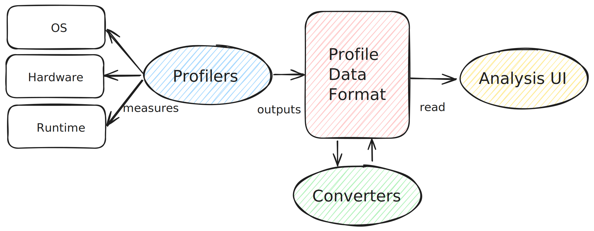

# Profiling

This is an attempt to map the software profiling ecosystem, with a focus on the OCaml programming language.
A review / survey of profilers, their data formats, analysis UIs and converters between data formats.

## Profilers

There are a number of different profilers available for OCaml, each with their strengths and usecases.

| Profiler    | Purpose                                                                                  | Profile Data Format                                | Link                    |
|:------------|:-----------------------------------------------------------------------------------------|:---------------------------------------------------|-------------------------|
| olly        | observability tools around the runtime events tracing system introduced in OCaml 5.0     | Chrome Tracing Format (JSON), Fuchsia Trace Format | [runtime-events-tool]() |
| magic-trace | collects and displays high-resolution traces of what a process is doing                  | Fuchsia Trace Format                               | [magic-trace]()         |
| memtrace    | Statistical Memory Profiling for OCaml aka statmemprof                                   | Common Trace Format (CTF)                          | [memtrace]()            |
| eio-trace   | eio-trace can be used to record and display traces of programs using the [eio]() library | Fuchsia Trace Format                               | [eio-trace]()           |
|             |                                                                                          |                                                    |                         |
| perf        | General-purpose profiler that uses hardware performance counters on Linux                | Common Trace Format (CTF)                          |                         |
| Instruments | General-purpose profiler that comes with Xcode on macOS                                  |                                                    |                         |
| dtrace      | General Performance analysis tool for FreeBSD, Solaris and MacOS                         |                                                    | [dtrace]()              |
| eBPF        | General Performance analysis tool for Linux (similar to DTrace)                          |                                                    |                         |

The intent is to have a minimal set of Profile Data Formats produced by OCaml tooling that can be used with existing Analysis UI tools.

## Visualisation and Analysis UI

| Name            | Description                                                            | Profile Data Format           | Link                                      |
|:----------------|:-----------------------------------------------------------------------|:------------------------------|-------------------------------------------|
| Perfetto        | System profiling, app tracing and trace analysis                       | Fuchsia Trace Format (others) | [perfetto.dev]()                         |
| Speedscope      | An interactive flamegraph visualizer                                   | Various                       | [github.com/jlfwong/speedscope]()         |
| memtrace_viewer | Statistical Memory Profiler                                            | CTF                           | [github.com/janestreet/memtrace_viewer]() |
| flamegraph      | Stack trace visualiser                                                 | Folded Stacks                 | [www.brendangregg.com/flamegraphs.html]() |
| flamescope      | Visualization tool for exploring different time ranges as Flame Graphs | Linux perf script             | [github.com/Netflix/flamescope]()         |
| pprof           | Visualise profiling data as directed graph or flamegraphs              | Protocol Buffers              | [github.com/google/pprof]()               |

## Profile Data Format

Chrome Tracing Format is a textual JSON also know as Trace Event Format or Chrome Performance Profile.
[spec](https://docs.google.com/document/d/1CvAClvFfyA5R-PhYUmn5OOQtYMH4h6I0nSsKchNAySU/preview)
No OCaml libraries for reading / writing

Fuchsia Trace Format is a binary format used to collect, store, and transmit trace records. Focuses on performance.
[spec](https://fuchsia.googlesource.com/fuchsia/+/refs/heads/main/docs/reference/tracing/trace-format.md)
Two libraries for reading / writing [trace-fuchsia](https://github.com/c-cube/ocaml-trace) and
[tracing](https://github.com/janestreet/tracing).

Common Trace Format is a binary trace format designed to be very fast to write. Uses a declaritive language called
the _Trace Stream Description Language_ TSDL to describe trace stream layout.
[spec](https://diamon.org/ctf/)
No OCaml libraries for reading / writing.

Pprof is a common stacktrace profile format using [protocol buffers](https://github.com/google/pprof/blob/main/proto/profile.proto).
Used by [pprof](https://github.com/google/pprof) supported as an input format by Speedscope and commercial monitoring tools (Google Cloud Profiler, Polar Signals, Datadog).

## Converters

Nothing to see here!

## Walk throughs

 * OCaml 5 Performance [part 1](https://roscidus.com/blog/blog/2024/07/22/performance/)/[part 2](https://roscidus.com/blog/blog/2024/07/22/performance-2/) comprehensive investigation of OCaml 5 performance for an application.
 * Generating CPU Flamegraphs for OCaml on Linux [here](flamegraphs-linux.md)
 * Generating CPU Flamegraphs for OCaml on MacOS [here](flamegraphs-macos.md)
 * Memory profiling with statmemprof in [4.14 LTS](statmemprof-4-lts.md) and [5.3](statmemprof-5.md)

## Resources

This format was inspired by [https://profilerpedia.markhansen.co.nz](https://profilerpedia.markhansen.co.nz)

Prior art:
 * OCaml-bench profiling notes [https://github.com/ocaml-bench/notes/blob/master/profiling_notes.md](https://github.com/ocaml-bench/notes/blob/master/profiling_notes.md)

[runtime-events-tools]: https://github.com/tarides/runtime_events_tools
[magic-trace]: https://github.com/janestreet/magic-trace
[memtrace]: https://github.com/janestreet/memtrace
[dtrace]: https://dtrace.org/
[eio]: https://github.com/ocaml-multicore/eio
[eio-trace]: https://github.com/ocaml-multicore/eio-trace
[perfetto.dev]: https://ui.perfetto.dev/
[github.com/jlfwong/speedscope]: https://github.com/jlfwong/speedscope
[github.com/janestreet/memtrace_viewer]: https://github.com/janestreet/memtrace_viewer
[www.brendangregg.com/flamegraphs.html]: https://www.brendangregg.com/flamegraphs.html
[github.com/Netflix/flamescope]: https://github.com/Netflix/flamescope
[github.com/google/pprof]: https://github.com/google/pprof/blob/main/doc/README.md
